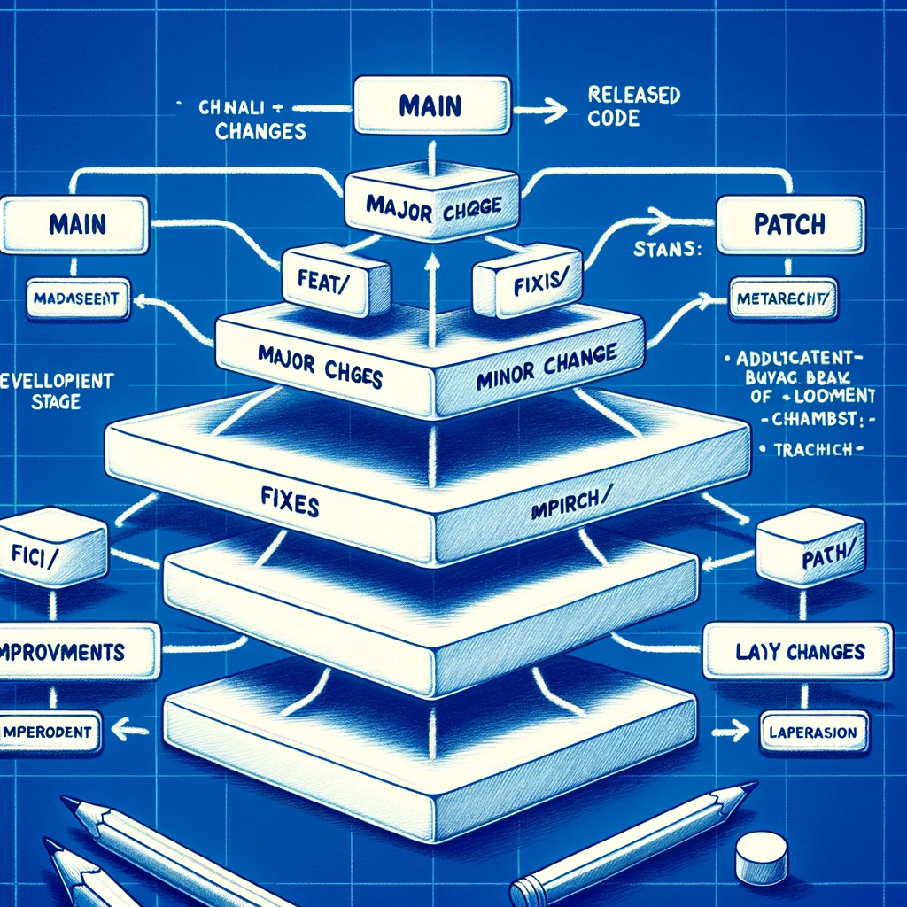

### Canonical Branch Naming Policy

#### Hierarchical Branch Structure
- **Main Branch (`main`)**: Contains stable and released code.

#### First Hierarchical Level: Type of Change
- **Major Changes (`major/`)**: For incompatible changes that significantly alter existing functionalities.
- **Minor Changes (`minor/`)**: For adding new features in a backward-compatible manner.
- **Patch Changes (`patch/`)**: For bug fixes and minor improvements.

#### Second Hierarchical Level: Category of Change
- **Features (`feat/`)**: New features or significant improvements.
- **Fixes (`fix/`)**: Bug fixes and issue resolutions.
- **Improvements (`improve/`)**: Enhancements to existing features.
- **Layout Changes (`layout/`)**: Layout or design alterations.

#### Additional Hierarchical Levels: Specific Context
- After the second level, contextual names related to the business or specific change can be added.
- Examples:
  - `/patch/fix/input-text-mask-moving-character`
  - `/major/feat/refactory-theme-by-librarie`
  - `/minor/feat/emoji-display-when-typing`

### Workflow
1. **Development**: Work is carried out on specific branches, following the established hierarchy.
2. **Integration and Review**: Upon completion, changes are reviewed and tested.
3. **Merging into Main**: Approved changes are merged into `main`.

### Objective
This branch naming policy aims to provide clear and efficient organization of the development workflow, facilitating the identification and tracking of changes.

### Considerations
- The hierarchical structure aids in identifying the type and scope of changes.
- Branch names should be clear and descriptive, reflecting the purpose of the change.
- Tags and releases are managed separately as features of GitHub and are not part of branch names.

### Feedback
We encourage the team to discuss and adapt this policy as necessary to meet the specific needs of the `Malnati/template-electron-react` project.

### Política de Nomeação de Branches com Hierarquia Canônica

#### Estrutura Hierárquica de Branches
- **Branch Principal (`main`)**: Contém o código estável e lançado.

#### Primeiro Nível Hierárquico: Tipo de Mudança
- **Major (`major/`)**: Para mudanças incompatíveis que alteram funcionalidades existentes de forma significativa.
- **Minor (`minor/`)**: Para adição de novas funcionalidades de forma compatível.
- **Patch (`patch/`)**: Para correções de bugs e melhorias menores.

#### Segundo Nível Hierárquico: Categoria da Mudança
- **Funcionalidades (`feat/`)**: Novas funcionalidades ou melhorias significativas.
- **Correções (`fix/`)**: Correções de bugs e problemas.
- **Melhorias (`improve/`)**: Aprimoramentos em funcionalidades existentes.
- **Layout (`layout/`)**: Alterações de layout ou design.

#### Níveis Hierárquicos Adicionais: Contexto Específico
- Após o segundo nível, podem ser adicionados nomes contextuais relacionados ao negócio ou à mudança específica.
- Exemplos:
  - `/patch/fix/input-text-mask-moving-character`
  - `/major/feat/refactory-theme-by-librarie`
  - `/minor/feat/emoji-display-when-typing`

### Fluxo de Trabalho
1. **Desenvolvimento**: O trabalho é realizado nas branches específicas, seguindo a hierarquia estabelecida.
2. **Integração e Revisão**: Após a conclusão, as mudanças são revisadas e testadas.
3. **Mesclagem na Main**: As mudanças aprovadas são mescladas na `main`.

### Objetivo
Esta política de nomeação de branches visa proporcionar uma organização clara e eficiente do fluxo de trabalho de desenvolvimento, facilitando a identificação e o rastreamento de mudanças.

### Considerações
- A estrutura hierárquica facilita a identificação do tipo e do escopo das mudanças.
- Os nomes das branches devem ser claros e descritivos, refletindo o propósito da mudança.
- Tags e releases são gerenciados separadamente como funcionalidades do GitHub e não fazem parte dos nomes das branches.

### Feedback
Encorajamos a equipe a discutir e adaptar esta política conforme necessário para atender às necessidades específicas do projeto `Malnati/template-electron-react`.

    Author: Ricardo Malnati